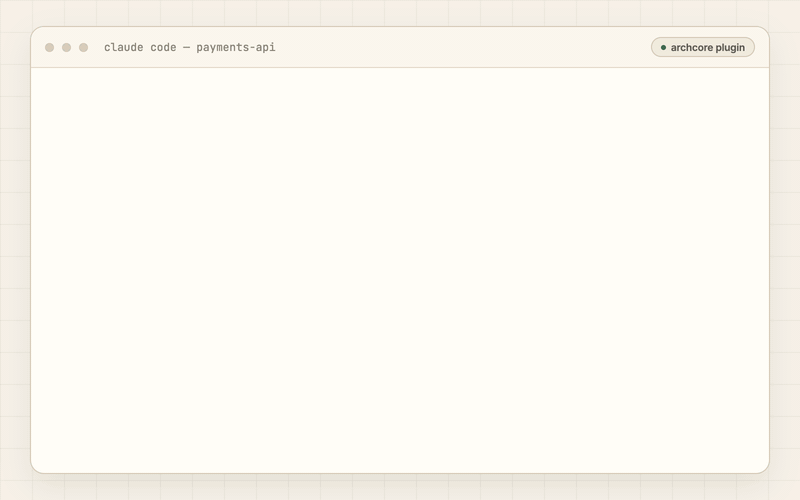
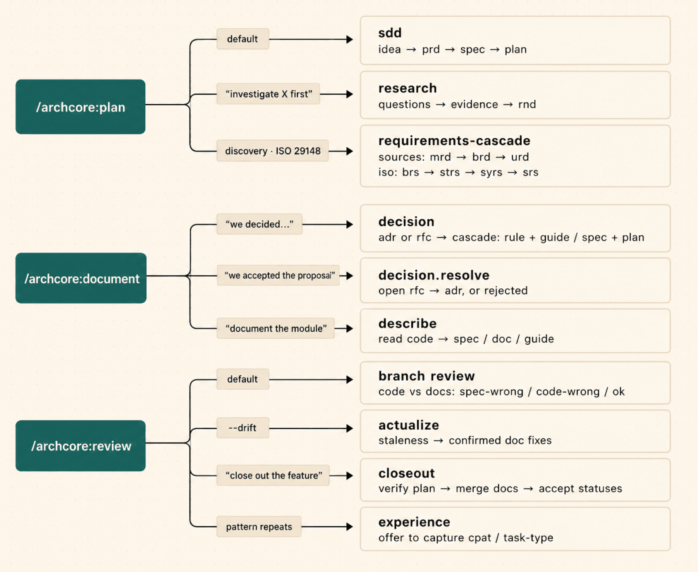

# Archcore Plugin — Spec-Driven Development & Context Engineering for AI Coding Agents

[](https://opensource.org/licenses/Apache-2.0)

**Make your AI coding agent work like it already knows your repo.**

Archcore brings spec-driven development and automatic project context to **Claude Code**, **Cursor**, **Codex CLI**, and **GitHub Copilot CLI**. Specs, architecture, decisions, rules, and plans live in Git and are applied as the agent works.

The plugin pairs with [Archcore CLI](https://github.com/archcore-ai/cli): the CLI provides the git-native context layer and MCP tools; the plugin adds skills, slash commands, gated tracks, routing, and guardrails.

[Spec-driven development](https://archcore.ai/spec-driven-development/) defines intent. [Context engineering](https://archcore.ai/context-engineering/) supplies the broader project understanding needed to execute that intent correctly — a spec is one part of context, not the whole context.

## See it work

The agent pulls in the rules and decisions that apply — no command needed — and still gives you the four commands below for anything explicit.



## Commands

Describe what you want in plain English — Archcore routes it. The slash commands below are shortcuts to the same tracks.

| Command              | Outcome                                             | When to use                                                                                                                                                                                                                                               |
| -------------------- | --------------------------------------------------- | --------------------------------------------------------------------------------------------------------------------------------------------------------------------------------------------------------------------------------------------------------- |
| `/archcore:init`     | Make your repo legible to AI agents                 | First-time setup — detects your repo's scale, seeds a first-day pack (stack rule, run guide, architecture overview, specs for hotspot modules) in one preview, wires host configs, and imports your `CLAUDE.md` / `AGENTS.md` / `.cursorrules` if present |
| `/archcore:plan`     | Turn an idea into a scoped implementation plan      | New feature, refactor, or initiative — escalates into full spec-driven or requirements-cascade flows when the work needs that depth                                                                                                                       |
| `/archcore:document` | Record a decision or document what lives in code    | A decision was made (ADR/RFC, optionally codified as a team rule), or a module, API, or integration has tribal knowledge but no doc yet                                                                                                                   |
| `/archcore:review`   | Check your changes and your docs against each other | Before merge — reviews the branch against recorded rules and decisions; add `--drift` for code/doc staleness, `--deep` for a full documentation audit                                                                                                     |

Everyday context needs no command at all: hooks inject the applicable rules and specs when the agent edits a file, and the session starts with a recap of what's decided and in progress.

### Inside the commands: tracks

The three work commands route into small gated flows — tracks. Each track is a short chain of gates that produces typed, linked documents in `.archcore/`:



You never pick a track — the wording of the request routes it (naming one works too: `plan research`, `review closeout`). Every gate skips itself when an existing document already covers it, so a fully-specified request runs question-free; a vague one stays within 5 questions. An interrupted flow resumes in a later session — the draft document carries the track state.

## Install

Archcore plugins require the **Archcore CLI** on `PATH` — it serves the MCP server the plugin talks to.

```bash
# macOS / Linux / WSL
curl -fsSL https://archcore.ai/install.sh | bash

# Windows (PowerShell 5.1+)
irm https://archcore.ai/install.ps1 | iex
```

Verify: `archcore --version` · Update: `archcore update` · Docs: [docs.archcore.ai/cli/install](https://docs.archcore.ai/cli/install/)

Then add the plugin in your host:

**Claude Code**

```bash
/plugin marketplace add archcore-ai/plugin
/plugin install archcore@archcore-plugins
```

**Cursor** — requires Cursor 2.5+. Open **Plugins**, paste `https://github.com/archcore-ai/plugin` into **Search or paste link**, click **Add Plugin**. One-time MCP setup: copy [`docs/cursor.mcp.example.json`](docs/cursor.mcp.example.json) into `~/.cursor/mcp.json` (user-scoped) or `.cursor/mcp.json` (project-scoped).

**Codex CLI** — requires Codex CLI v0.117.0+.

```bash
codex plugin marketplace add archcore-ai/plugin
codex
# then run /plugins, open Archcore, select Install plugin
```

**GitHub Copilot CLI** — two steps, both required. The plugin brings skills, commands, agents and hooks — but on Copilot it **cannot** bring the MCP server, so a project that skips step 2 has no document tools at all.

```bash
# 1. Install the plugin (from this repo's plugin subdirectory)
copilot plugin install archcore-ai/plugin:plugins/archcore

# 2. Wire your project (registers the MCP server; run once per repo, commit the result)
archcore init --agent copilot --project "$PWD"
```

Copilot **CLI** only: VS Code agent mode has no self-serve plugin install, and cloud-agent sandboxes do not load plugin hooks.

Why step 2 is not optional: a plugin's MCP server is launched in the plugin install directory with no project path ([github/copilot-cli#4234](https://github.com/github/copilot-cli/issues/4234)), so it would serve the plugin cache rather than your repo. The plugin therefore ships no MCP server to Copilot at all, and the project-level one from step 2 is the only source of document tools. Archcore CLI ≥ v0.6.7 refuses to serve from a plugin cache by design, so the failure mode is loud rather than silent.

<details>
<summary>Local development & team rollouts</summary>

**Claude Code** — load the plugin for the current session:

```bash
claude --plugin-dir /path/to/plugin
```

**Cursor** — symlink the repo into Cursor's local plugins directory and reload the window:

```bash
ln -s /path/to/plugin ~/.cursor/plugins/local/archcore
# then in Cursor: Cmd/Ctrl+Shift+P → "Developer: Reload Window"
```

**Codex CLI** — point a local marketplace at the checkout:

```bash
codex plugin marketplace add /path/to/plugin
codex plugin add archcore@archcore-plugins
```

**GitHub Copilot CLI** — load the plugin directory directly:

```bash
copilot --plugin-dir /path/to/plugin/plugins/archcore
```

**Cursor team rollouts** — Dashboard → Settings → Plugins → Team Marketplaces → Import (paste the GitHub URL).

</details>

## Try these first

Open your project and try these three prompts. Each shows a different side of what your agent can now do.

> Empty repo? Run `/archcore:init` first — it seeds a stack rule, a run-the-app guide, and optionally imports your existing `CLAUDE.md` / `AGENTS.md` / `.cursorrules`.

**1. "Before I change anything in `src/auth/`, what should I know?"**
Your agent sees what's already decided for that path — _before_ it touches the code.

**2. "Add a new API handler and follow this repo's conventions."**
Your agent places the handler where your architecture says it belongs, instead of guessing.

**3. "We picked PostgreSQL — record it as a team standard."**
The decision is captured, codified as a rule, and auto-applied to every future change in the same area. Decisions stop dying in chat scrollback.

## What changes after install

### ❌ Without Archcore

- the agent guesses your folder structure
- re-litigates decisions your team already made
- needs the same conventions repeated in every chat
- loses project truth the moment the session ends

### ✅ With Archcore

- code lands where your architecture says it belongs
- respects decisions already in Git
- follows team conventions loaded automatically
- reflects new decisions as future guardrails — not markdown graveyards

> **The agent stops guessing and starts following the system.**

## Use Archcore when

- Your agent writes code, but not the way this repo expects
- Your `CLAUDE.md` / `.cursorrules` / `AGENTS.md` keeps growing and drifting
- You work with 2+ agents or 2+ host tools (Claude Code + Cursor + Codex + Copilot)
- You want decisions, rules, and specs in Git — not in chat scrollback

**Not for** — chat memory, a prompt library, or a one-shot spec-to-code generator. Archcore is a git-native context layer for AI coding agents, not a methodology kit.

## Supported hosts

| Host                                                          | Status      | Install                                |
| ------------------------------------------------------------- | ----------- | -------------------------------------- |
| [**Claude Code**](https://archcore.ai/claude-code/)           | Production  | Plugin marketplace                     |
| [**Cursor**](https://archcore.ai/cursor/)                     | Implemented | Plugin marketplace                     |
| [**Codex CLI**](https://archcore.ai/codex/)                   | Implemented | Plugin marketplace                     |
| [**GitHub Copilot CLI**](https://archcore.ai/github-copilot/) | Implemented | `copilot plugin install` (subdir spec) |

Built on open standards (Agent Skills, MCP) — skills and MCP tools are shared across hosts; only manifests are host-specific.

## How Archcore differs

| Tool                                                                                                                       | Category          | How Archcore differs                                                                                                                                                           |
| -------------------------------------------------------------------------------------------------------------------------- | ----------------- | ------------------------------------------------------------------------------------------------------------------------------------------------------------------------------ |
| **BMAD / Spec Kit / Agent OS**                                                                                             | Methodology       | Methodology tools define a development process. Archcore keeps the resulting project knowledge alive, connected, versioned, and available to agents throughout implementation. |
| **Superpowers**                                                                                                            | Methodology       | Shapes _agent behavior_; Archcore provides _canonical project knowledge_ any agent can read.                                                                                   |
| [**`AGENTS.md`**](https://archcore.ai/agents-md/) / [**`CLAUDE.md`**](https://archcore.ai/claude-md/) / **`.cursorrules`** | Instruction files | Instruction files are useful entry points. Archcore adds typed documents, relations, lifecycle, selective retrieval, and cross-agent portability.                              |
| **claude-mem / Mem0 / agentmemory**                                                                                        | Memory            | Memory remembers what happened in previous sessions. Archcore stores what the project says is true.                                                                            |
| **Cline Memory Bank**                                                                                                      | Docs              | Same spirit, lower ceremony. Archcore adds typed relations and validated multi-step cascades.                                                                                  |

Pick a methodology tool for an opinionated dev flow. Pick a memory tool for session continuity. Pick Archcore when you want typed, queryable **project truth** that your coding agent respects on every request.

## Uninstall

**Claude Code:** `/plugin uninstall archcore@archcore-plugins`
**Cursor:** remove from plugin settings.
**Codex CLI:** `codex plugin uninstall archcore`
**GitHub Copilot CLI:** `copilot plugin uninstall archcore`

## License & contributing

[Apache-2.0](LICENSE) · Issues and ideas: [GitHub Issues](https://github.com/archcore-ai/plugin/issues)
